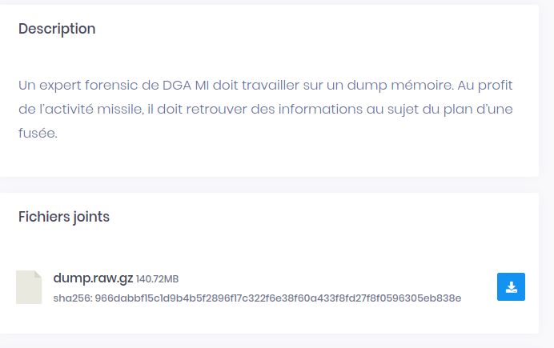

# Bwing



## wu

Nous avons un dump mémoire, la première chose a faire est de l'identifier:

```
$strings dump.raw |grep "Linux "|head -n 30

Linux version 4.15.0-66-generic (buildd@lgw01-amd64-044) (gcc version 7.4.0 (Ubuntu 7.4.0-1ubuntu1~18.04.1)) #75-Ubuntu SMP Tue Oct 1 05:24:09 UTC 2019 (Ubuntu 4.15.0-66.75-generic 4.15.18)
```

On vérifie:

https://fr.wikipedia.org/wiki/Liste_des_versions_d%27Ubuntu

```
$strings dump.raw |grep "Bionic Beaver"
VERSION="18.04.3 LTS (Bionic Beaver)"
Name: Bionic Beaver
18.04 LTS,Bionic Beaver,bionic,2017-10-19,2018-04-26,2023-04-26,2023-04-26,2028-04-26
VERSION="18.04.3 LTS (Bionic Beaver)"
```

On télécharge la <a href="http://old-releases.ubuntu.com/releases/18.04.3/">bonne image</a> et on crée un profil avec volatility.


Et ensuite on l'analyse, toujours avec volatility:

```
python vol.py --profile=LinuxUbuntu1804-4_15_0-66-genericx64  -f ../dump.raw linux_enumerate_files > linux_enumerate_files.txt
```

Avec un peu de recherche on tombe sur :
```
$cat linux_enumerate_files.txt |grep confidential
0xffff95a89ac58528                    256033 /mnt/confidential
               0x0 ------------------------- /usr/lib/systemd/user/mnt-confidential.mount.d
               0x0 ------------------------- /usr/lib/systemd/user/mnt-confidential.mount.requires
               0x0 ------------------------- /usr/lib/systemd/user/mnt-confidential.mount.wants
               0x0 ------------------------- /usr/lib/systemd/user/mnt-confidential.mount
               0x0 ------------------------- /lib/systemd/system/mnt-confidential.mount.d
               0x0 ------------------------- /lib/systemd/system/mnt-confidential.mount.requires
               0x0 ------------------------- /lib/systemd/system/mnt-confidential.mount.wants
               0x0 ------------------------- /lib/systemd/system/mnt-confidential.mount
               0x0 ------------------------- /etc/systemd/user/mnt-confidential.mount.d
               0x0 ------------------------- /etc/systemd/user/mnt-confidential.mount.requires
               0x0 ------------------------- /etc/systemd/user/mnt-confidential.mount.wants
               0x0 ------------------------- /etc/systemd/user/mnt-confidential.mount
               0x0 ------------------------- /etc/systemd/system/mnt-confidential.mount.d
               0x0 ------------------------- /etc/systemd/system/mnt-confidential.mount.requires
               0x0 ------------------------- /etc/systemd/system/mnt-confidential.mount.wants
               0x0 ------------------------- /etc/systemd/system/mnt-confidential.mount
0xffff95a89ac74000                     22086 /mnt/confidential
0xffff95a89ac72260                     22114 /mnt/confidential/flag.txt
```

On extrait le fichier qui nous intéresse:
```
$python vol.py --profile=LinuxUbuntu1804-4_15_0-66-genericx64  -f ../dump.raw linux_find_file -i 0xffff95a89ac72260 -O flag
```

Le flag:
```
$cat flag 
C0D3N4M34P011011
```


