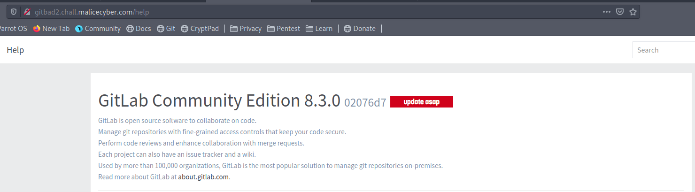
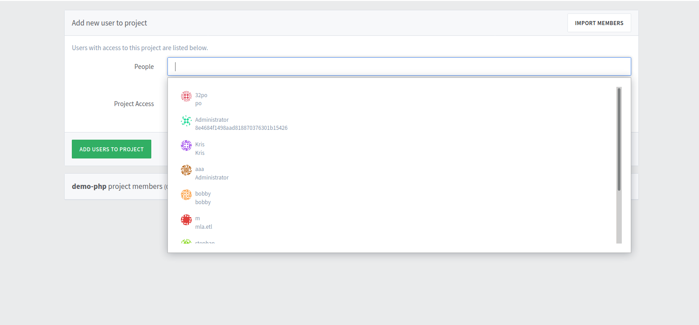
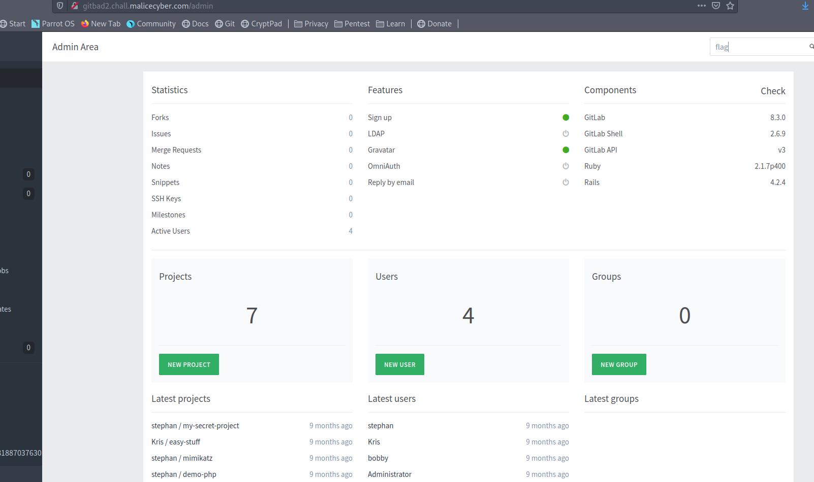
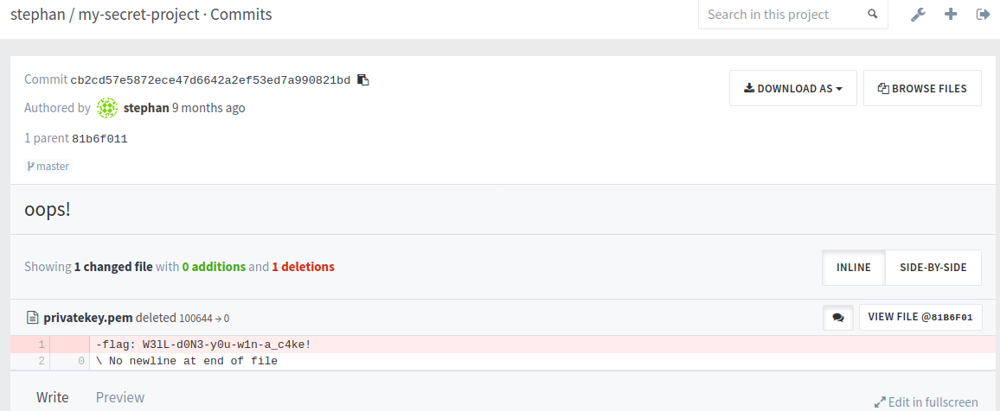

# Gitbad

## wu

Se logger avec un identifiant et chercher la version de Gitlab:

Avec un peu de recherche sur le net, on peux trouvé cette <a href="https://www.exploit-db.com/exploits/40236">CVE</a>

Avec Burpsuite, on edit notre requete pour modifier nos informations. On choisis l'user stephan qu'on a pu trouvé en cherchant les différents utilisateurs/repos.

Un fois connecté avec les droits de stephan, on cherche l'admin.

En créant un dépot, on peux ajouté un collaborateur

On refait donc la meme manip pour se connecter avec l'admin : 8e4684f1498aad818870376301b15426.

On cherche un moment... au final, le repo stephan/my-secret-project est le seul intéressant.

On se donne les droits dessus et on regarde les commits.

FLAG: W3lL-d0N3-y0u-w1n-a_c4ke!
