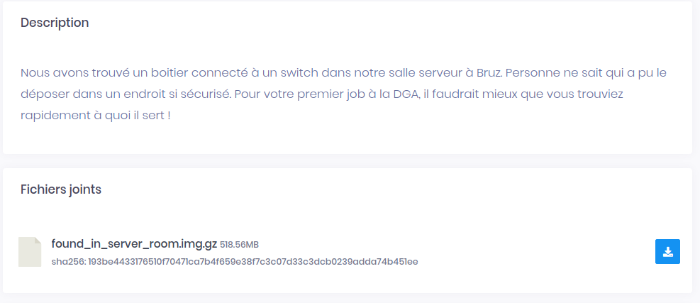
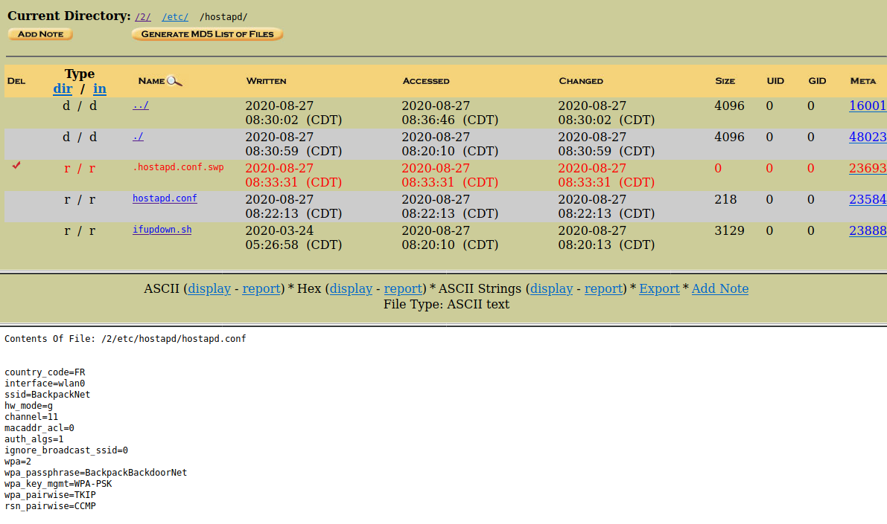

# Server Room



## Wu

Nous avons un dump d'un raspberry Pi, on l'analyse avec autopsy


On check l'historique root:
```
Contents Of File: /2/root/.bash_history


cd /etc/wpa_supplicant/
ls
mv wpa_supplicant.conf wpa_supplicant.conf.old
ls
nano wpa_supplicant.conf
hostapd
cd
ls
nano hostapd
nano /etc/sysctl.d/90-routing.conf
ip a
ip a
dhclient -v eth0
dhclient -r
dhclient -v eth0
dhclient -v eth0
ip a
ping 1.1.1.1
ip a
dhclient -r
ip a
dhclient -v eth0
ping 1.1.1.1
 ipa
ip a
ip r
ping 1.1.1.1
ip r
ping 1.1.1.1
apt update
apt upgrade
apt install hostapd iptables-persistant
apt install hostapd iptables-persistent
iptables -L
iptables -t nat -A POSTROUTING -o eth0 -j MASQUERADE
netfilter-persistent save
apt install dnsmasq
systemctl enable hostapd
systemctl unmask hostapd
systemctl enable hostapd
cp /root/hostapd /etc/hostapd/hostapd.conf
rm /root/hostapd 
systemctl start hostapd
systemctl status hostapd
systemctl status hostapd
rfkill unblock all
systemctl status hostapd
systemctl status hostapd
systemctl status hostapd
systemctl status hostapd
systemctl restart hostapd
systemctl status hostapd
systemctl status hostapd
systemctl status hostapd
systemctl status hostapd
nano /etc/dnsmasq.conf 
nano /etc/dhcpcd.conf 
nano /etc/dnsmasq.conf 
nano /etc/wpa_supplicant/wpa_supplicant.conf
nano /etc/wpa_supplicant/wpa_supplicant.conf
nano /etc/wpa_supplicant/wpa_supplicant.conf.old 
rm /etc/wpa_supplicant/wpa_supplicant.conf
mv /etc/wpa_supplicant/wpa_supplicant.conf.old /etc/wpa_supplicant/wpa_supplicant.conf
systemctl enable dnsmasq
systemctl enable iptables-persistent
systemctl enable iptables
systemctl enable netfilter
systemctl enable netfilter-persistent
systemctl reboot
nano /etc/dnsmasq.conf 
systemctl start dnsmasq
systemctl status dnsmasq
systemctl status hostapd
nano /etc/hostapd/hostapd.conf 
systemctl reboot
history
```

On va regardé dans /etc/hostapd/hostapd.conf
```
Contents Of File: /2/etc/hostapd/hostapd.conf


country_code=FR
interface=wlan0
ssid=BackpackNet
hw_mode=g
channel=11
macaddr_acl=0
auth_algs=1
ignore_broadcast_ssid=0
wpa=2
wpa_passphrase=BackpackBackdoorNet
wpa_key_mgmt=WPA-PSK
wpa_pairwise=TKIP
rsn_pairwise=CCMP
```



le flag est : BackpackBackdoorNet
