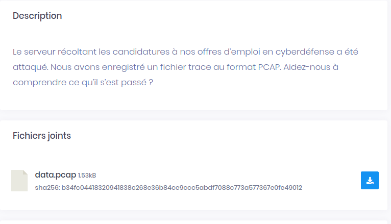

# Time For Something Different




## wu

Nous avons un fichier pcap avec des trames ICPM identique, la seul chose qui change se sont les temps.

On export les données en CSV avec wireshark en json.

```
$cat export.json |grep "frame.time_delta\""
          "frame.time_delta": "0.000000000",
          "frame.time_delta": "0.703011000",
          "frame.time_delta": "0.762847000",
          "frame.time_delta": "0.653169000",
          "frame.time_delta": "0.712814000",
          "frame.time_delta": "1.233287000",
          "frame.time_delta": "1.163554000",
          "frame.time_delta": "0.482726000",
          "frame.time_delta": "0.482477000",
          "frame.time_delta": "1.152388000",
          "frame.time_delta": "1.083260000",
          "frame.time_delta": "1.113100000",
          "frame.time_delta": "0.872616000",
          "frame.time_delta": "1.113221000",
          "frame.time_delta": "1.143160000",
          "frame.time_delta": "1.163288000",
          "frame.time_delta": "0.482574000",
          "frame.time_delta": "0.482596000",
          "frame.time_delta": "0.682909000",
          "frame.time_delta": "0.512060000",
          "frame.time_delta": "1.183053000",
          "frame.time_delta": "0.492873000",
          "frame.time_delta": "1.112238000",
          "frame.time_delta": "1.173303000",
          "frame.time_delta": "0.361740000",
          "frame.time_delta": "1.253465000",
```

On fait la correspondance avec la table ascii

```
00
70 F
76 L
65 A
71 G
123 {
116 t
48 0
48 0
115 s
108 l
111 o
87 W
111 o
114 r
116 t
48 0
48 0
68 D
51 3
118 v
49 1
111 o
117 u
136 $
25 }
```


